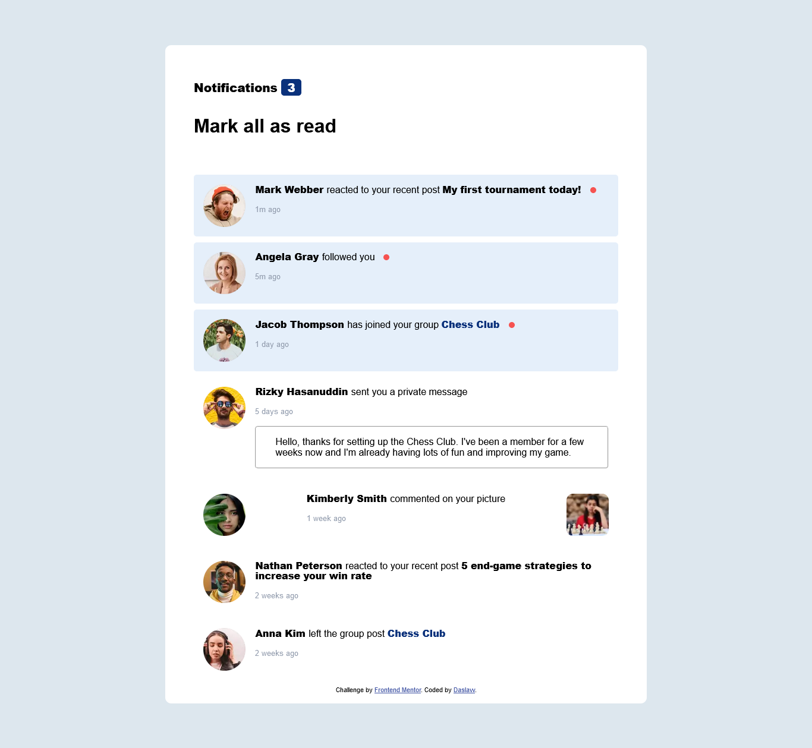

# Frontend Mentor - Notifications page solution

This is a solution to the [Notifications page challenge on Frontend Mentor](https://www.frontendmentor.io/challenges/notifications-page-DqK5QAmKbC). Frontend Mentor challenges help you improve your coding skills by building realistic projects. 

## Overview

This challenge was gotten from Frontend Mentor and facilitated by Andrew James Okpainmo.

**To do this challenge, you need a basic understanding of HTML, CSS and JavaScript.**

### The challenge

Users should be able to:

- View the optimal layout depending on their device's screen size

### Screenshot

### Links

- Solution URL: (https://github.com/Daslaw/Notifications_page.git)
- Live Site URL:(https://daslaw.github.io/Notifications_page/)

## My process

- Write and Format the HTML section of the Project
- Styling with CSS
- Pushed and hosted on GITHUB

### Built with

- Semantic HTML5 markup
- CSS custom properties
- Flexbox
- Media Query

### Tools

- VScode
- Chrome Browser

### What I learned

- CSS styling with Flexbox and Media Query
- README formatting

## Acknowledgments

Thanks to Andrew James Okpainmo
